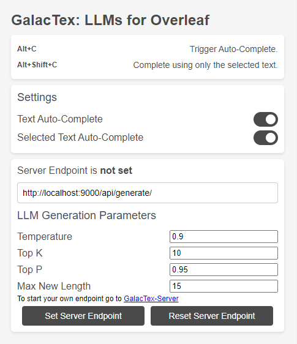

# GalacTex: Large Language Models for Overleaf

This Chrome extension adds the power of large-language models (LLMs) to Overleaf through a Chrome extension and a self-hosted server running the [Galactica](https://github.com/paperswithcode/galai) LLM.

The extension originated from [GPT4Overleaf](https://github.com/e3ntity/gpt4overleaf) and [LeafLLM](https://github.com/bThink-BGU/LeafLLM).

  

## Installation from Chrome Web Store (preferred option)
Unless you are a developer, this is probably your preferred option.

Just go to the [extension's page](https://chrome.google.com/webstore/detail/GalacTex/) in Chrome Web Store and press "Add to Chrome"

## Manual installation
1. Clone the repository
2. Open Chrome and go to `chrome://extensions/`
3. Enable developer mode
4. Click "Load unpacked" and select the repository folder

## Installation of the server
Head to the [GalacTex-Server](https://github.com/WissamAntoun/GalacTex-Server) repository and follow the instructions there.

## Configuration
The plugin can be configured by clicking the plugin button in the Chrome toolbar. It requires inserting the server endpoint for the self-hosted server. You also need to choose which tools you wish to enable. You have the ability to tune the generation paramaters from the plugin's popup.

## Usage
These are the tools that are currently available:

### Auto-complete
Press `Alt+C` to trigger the auto-complete tool.

### Auto-complete Selection
Select a text and press `Alt+Shift+C` to trigger the auto-complete tool. The selected text will be used as the prompt.

## Issues
If nothing happens when you use the plugin, verify that the plugin's shortcuts are not in conflict with other plugins' shortcuts [here](chrome://extensions/shortcuts).

If you encounter any problem/question, please open an issue in the project's repository.

## Privacy
The plugin saves its configuration locally on the users' computer. The plugin's authors do not collect any data from the plugin's users.